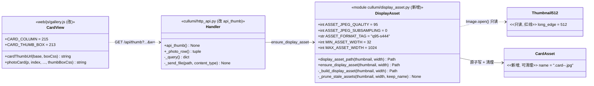
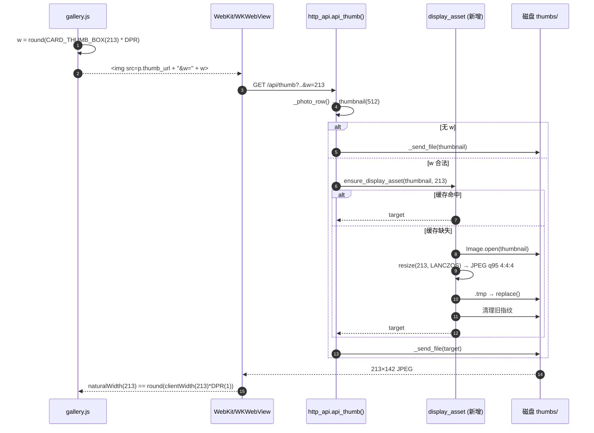
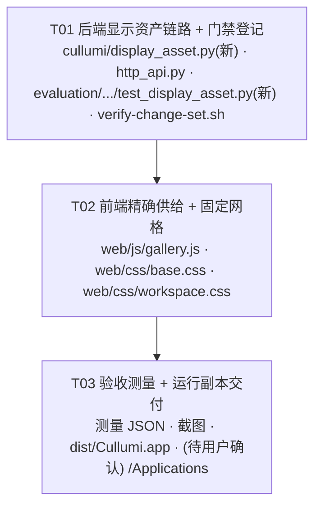

# 架构设计 + 任务分解：照片库卡片预览锐度修复（增量 · preview-sharpness）

| 项 | 内容 |
|---|---|
| Language | 简体中文 |
| 项目 | `cullumi-macos`（Cullumi 照片筛选工具 · macOS 版 · Python `ThreadingHTTPServer` + 无构建工具的经典 JS `web/`） |
| 变更类型 | **增量**（修补既有功能，不新建产品、不引入构建工具、不新增依赖） |
| 事实来源 | `evaluation/preview-resolution/README.md`（设计中的所有数字均引自它，本文不重新推导） |
| 上游输入 | `deliverables/preview-sharpness/PRD.md`（产品经理产出）、`verify-change-set.sh`、`verify-macos.sh` |
| 裁决继承 | PRD §4 Q1–Q4 已由主理人裁决（Q1a / Q2=方案A / Q3 纳入 DPR=2 / Q4 纳入但需用户确认），本设计照此执行，不再另开问题 |

---

## 0. 结论先行（架构师定稿摘要）

1. **主因确认**：不是像素不够，而是**供给尺寸与显示框对不上**（512 缩进 215 设备像素，倍率 2.38）。解法 = **让卡片图片框尺寸确定化 + 服务端按精确尺寸出图**。
2. **供给来源（评估主理人建议 → 采纳）**：显示用资产**从现有 512px 分析缩略图派生**，**不再解码原图**。理由见 §1.2。
3. **红线**：**绝不触碰 512px 分析缩略图**（它同时是 NIQE / sharpness 输入、`analysis_version()` 指纹 `rgb512-v1`/`raw-preview512-v2` 与 `NIQE_VERSION` 基线的依据）。
4. **落地形态**：`.gallery` 改**固定列宽 215px**；卡片图片框实测 = **213px**（`215 − 2×1px 卡片边框`，box-sizing:border-box）；前端按 `round(213 × DPR)` 请求 `w`（DPR=1 → 213，DPR=2 → 426）；后端新增 `w` 参数，从 512 缩略图 LANCZOS 派生并原子缓存。
5. **实测自证（本次由架构师用真实 WebKit 量得，样本 = `sample.py` 唯一样本 DSC02017）**：
   - 图片框 213 + 供给 213（倍率 1.00）→ **lapvar 1499.8**（A2 门槛 ≥1300 ✓）
   - 图片框 215 + 供给 215（倍率 1.00）→ lapvar 1481.6（对照）
   - DPR=2：图片框 213 + 供给 426 → **lapvar 618.9**（B2 门槛 ≥600 ✓；参照目标 616.7）
   - DPR=2：图片框 215 + 供给 430 → lapvar 608.4
   → **固定列宽 215（图片框 213）在 DPR=1/2 都达标，且 213 分支在两项指标上都不劣于 215 分支。**
6. **⚠️ 门禁关键发现（与交接假设不同，已实测证实）**：**在 `tests/` 下新增文件会直接违反 `verify-change-set.sh` 硬底线 1**（冻结目录检查不区分 “Only in” 与 “differ”，只登记 `EXPECTED_ADDED` 并不够）。因此**新测试不放 `tests/`**，改放已登记的 `evaluation/preview-resolution/`。证据见 §5.2。
7. **改动面**：修改 4 个既有文件（`cullumi/http_api.py`、`web/js/gallery.js`、`web/css/base.css`、`web/css/workspace.css`）+ 新增 1 个后端模块 + 1 个测试脚本；`verify-change-set.sh` 登记 3 处白名单。**无新增第三方依赖，无构建工具。**

---

# Part A：系统设计

## 1. 实现方案

### 1.1 端到端数据流

```
分析阶段（既有，不动）:
  原图 ──open_image((512,512))──> draft 预缩 ──LANCZOS──> 512 长边 ──JPEG q86──> thumbs/<sha1>.jpg
                                                                                    │  512 分析缩略图
                                                                                    │  （NIQE/sharpness 输入，红线）
展示阶段（本次新增）:
                                                                                    ▼
  browser 计算 w = round(213 × DPR) ──GET /api/thumb?...&w=213──> api_thumb()
                                                                       │
                                        ensure_display_asset(thumbnail, 213)
                                                                       │  Image.open(512 缩略图).load()  ← 只读派生
                                                                       │  resize(213, LANCZOS) → JPEG q95 4:4:4
                                                                       ▼
                                        thumbs/<stem>.card-213-<fingerprint>.jpg（原子写 + 旧指纹清理）
                                                                       │
    ◄──213×142 JPEG──── _send_file(asset) ◄──────┘
```

关键点：**512 分析缩略图全程只读**；展示链路新增的 `.card-<w>-<fp>.jpg` 是**独立的第二套资产**（PRD P0-2「不得复用同一文件」）。

### 1.2 技术选型与难点分析

| 难点 | 抉择 | 理由（引自事实来源） |
|---|---|---|
| **供给来源：派生自 512 缩略图 vs 重新解码原图** | **派生自 512 缩略图（采纳主理人建议）** | ①`512→215` 的 LANCZOS 屏上参考值 2294.6，原图理论极限 2355.0 —— **512 资产本身只差 2.6%**；②原图解码代价高（HEIC 单张可达 **1655ms**，RAW 更甚）；③**512 缩略图在磁盘上已经存在**（扫描阶段已生成），派生它**几乎零额外解码成本**，且天然继承「源文件 `size:mtime` 指纹」这唯一的失效面；④不扩大缓存失效面。**结论：采纳，不推翻。** |
| **尺寸确定化：固定列宽 vs 前端量测（`ResizeObserver`）** | **固定列宽 + 服务端固定出图（采纳 PRD Q2 方案 A）** | 改动最小、确定性最强；量测方案需要「前端量测 + 后端按尺寸生成 + 更复杂的缓存」，且引入布局抖动。固定列宽后图片框恒为整数 CSS px，可直接推导供给尺寸。 |
| **DPR 适配：`srcset` vs JS 计算 `src`** | **JS 直接计算 `src`（不用 srcset）** | `srcset` 候选只能是 `{213, 426}` 这种粗粒度阶梯；实测反例证实**粗粒度阶梯会让浏览器挑错**（挑到 256 → 倍率 1.19 → lapvar 1091.8 **低于**当前基线，见 PRD P0-5/§3.5）。**JS 直接 `round(box×DPR)` 在 DPR 为整数时精确**（DPR=1→213、DPR=2→426，容差 0）。**⚠️ 非整数 DPR 下无法精确 1:1**：DPR=1.5 时图片框实际宽 213.6875 CSS px、设备宽 319.5~320.5（非整数），且 `round(213×1.5)=320` 而 `round(214×1.5)=321`——任何整数供给都满足不了 `naturalWidth == round(clientWidth×DPR)`，A1 会 FAIL。此为本方案的**已知限制**，PRD 验收范围只覆盖 DPR=1/2（详见 §5.5-U6 与 §5.6）。 |
| **是否需要 `image-rendering`** | **默认保持 `auto`**（PRD P2-3） | `-webkit-optimize-contrast` 实测等效最近邻（走样不是还原）；`high-quality` 在 WebKit 无效。 |
| 架构模式 | 沿用既有分层：HTTP 层（`http_api`）→ 领域/资产层（新 `display_asset`）→ 磁盘缓存（`thumbs/`）；前端沿用「经典 JS + 静态 CSS」，**不引入框架/打包器**。 | 与既有代码风格一致（`media.py` 的 `ensure_display_preview` 同构）。 |

### 1.3 固定列宽带来的连带影响（已核实的落点）

`.gallery` 在项目里有 **两处** 定义，都在 `web/css/base.css`：

- L411（主规则）：`grid-template-columns: repeat(auto-fill, minmax(210px, 1fr))` → 需改为 `repeat(auto-fill, 215px)`。
- L625（`@media(max-width:850px)` 覆盖）：`repeat(auto-fill, minmax(170px, 1fr))` → **必须一并确定化**，否则窄窗（窗口最小 980px，内容区 <850px）会退回可变列宽，破坏确定性。

另有两处**共享 `.gallery`** 的容器需要甄别：

- `web/index.html:101` `<div id="gallery" class="gallery">` —— **库卡片网格**，本次目标。
- `web/index.html:121` `<div id="similarDetailGallery" class="gallery similar-detail-gallery">` —— 相似详情网格，**同时带 `.gallery`**。它的列宽被 `.similar-detail-gallery`（`workspace.css:989`，`minmax(210px,210px)` 已固定 210）覆盖，但 `.gallery` 的 `justify-content` 会**泄漏**到它。为「外观不变」，需在 `workspace.css` 给 `.similar-detail-gallery` 补一条 `justify-content: start` 守卫（`web/css/workspace.css` 已在白名单内，改动不新增白名单项）。

> 尺寸常量：`.gallery` 列宽 **215px** → `.photo-card` 边框 1px（`box-sizing:border-box`，base.css:33 全局 `*{box-sizing:border-box}`）→ 图片框 `.thumb img` 宽 = **213px**。此 2px 差已由架构师用真实 WebKit 实测确认（见 §5.1 证据）。

---

## 2. 文件清单

### 新增文件

| 相对路径 | 一句话职责 |
|---|---|
| `cullumi/display_asset.py` | **新模块**：从 512 分析缩略图派生「显示用卡片资产」，提供 `display_asset_path()` / `ensure_display_asset()`（指纹命名 + 原子写 + 旧指纹清理 + 并发锁）。 |
| `evaluation/preview-resolution/test_display_asset.py` | **新测试**：对 `display_asset` 做单元验证（宽度正确、缓存命中、源变更失效、512 缩略图逐字节不变）。**因门禁原因不放 `tests/`**（§5.2）。 |
| `deliverables/preview-sharpness/ARCHITECTURE.md` | 本设计文档。 |
| `deliverables/preview-sharpness/class-diagram.mermaid` | 类图。 |
| `deliverables/preview-sharpness/sequence-diagram.mermaid` | 时序图。 |

> `deliverables/` 整个目录在门禁里是**一个** `added` 条目（`diff -rq` 对单侧存在的目录只报目录本身），故其内部文件（含 PRD、本设计、两张图）无需逐条登记。

### 修改文件

| 相对路径 | 一句话职责 |
|---|---|
| `cullumi/http_api.py` | `api_thumb()` 支持 `w` 查询参数：带 `w` → 出显示资产；不带 → 沿用旧行为出 512。**已在 `EXPECTED_DIFFER` 内。** |
| `web/js/gallery.js` | 新增 `CARD_COLUMN/CARD_BORDER/CARD_THUMB_BOX` 常量与 `cardThumbUrl()`；`photoCard()` 增可选入参 `thumbBoxCss`；库卡片两处调用点传入 `CARD_THUMB_BOX`。**已在 `EXPECTED_DIFFER` 与 `AUTHORIZED_WEB` 内。** |
| `web/css/base.css` | `.gallery` 主规则改固定列宽 215px + `justify-content: space-between`；`@media(max-width:850px)` 的 `.gallery` 覆盖确定化。**⚠️ 当前不在任何白名单 → 需同时登记 `EXPECTED_DIFFER` 与 `AUTHORIZED_WEB`。** |
| `web/css/workspace.css` | 给 `.similar-detail-gallery` 补 `justify-content: start` 守卫（防止 `.gallery` 的 `space-between` 泄漏改变相似详情布局）。**已在两清单内。** |
| `verify-change-set.sh` | 登记 `web/css/base.css`（两处）、`cullumi/display_asset.py`、`deliverables`（`EXPECTED_ADDED`），各附理由注释。 |

### 不改的文件（明确划线）

`cullumi/media.py`、`cullumi/photo_query_service.py`、`cullumi/scanner.py`、`web/js/similar.js`、`web/js/viewer.js`、`web/index.html`、`tests/**`、`models/**`。

---

## 3. 数据结构与接口

### 3.1 类图



（完整版见 `class-diagram.mermaid`。）

### 3.2 后端：`cullumi/display_asset.py`（新增）

```python
from __future__ import annotations

import hashlib
import threading
import uuid
from pathlib import Path

from PIL import Image

ASSET_JPEG_QUALITY = 95          # q95 + 4:4:4（见下）；213px 尺度上色度抽样代价大而字节收益极小
ASSET_JPEG_SUBSAMPLING = 0       # 0 = 4:4:4（无色度抽样）；Pillow 的 2 = 4:2:0
ASSET_FORMAT_TAG = "q95-s444"    # 并入缓存指纹：编码参数变化时旧资产自动失效
MIN_ASSET_WIDTH = 32             # 参数下界（防滥用/异常输入）
MAX_ASSET_WIDTH = 1024           # 参数上界（= 512 缩略图 2 倍，足以覆盖 DPR≤2；再大也不会更清晰）
_ASSET_LOCKS = [threading.Lock() for _ in range(64)]


def display_asset_path(thumbnail: Path, width: int) -> Path:
    """卡片显示资产的缓存路径；键 = 512 缩略图的 size:mtime_ns + 目标宽度 + 编码器版本。"""
    stat = thumbnail.stat()
    fingerprint = hashlib.sha1(
        f"{stat.st_size}:{stat.st_mtime_ns}:{width}:{ASSET_FORMAT_TAG}".encode("ascii")
    ).hexdigest()[:12]
    return thumbnail.with_name(f"{thumbnail.stem}.card-{width}-{fingerprint}.jpg")


def ensure_display_asset(thumbnail: Path, width: int) -> Path:
    """返回（必要时生成）宽度为 `width` 的显示资产；并发安全。"""
    if not (MIN_ASSET_WIDTH <= width <= MAX_ASSET_WIDTH):
        raise ValueError("卡片资产宽度超出允许范围")
    lock = _ASSET_LOCKS[hash((str(thumbnail), width)) % len(_ASSET_LOCKS)]
    with lock:
        return _build_display_asset(thumbnail, width)


def _build_display_asset(thumbnail: Path, width: int) -> Path:
    target = display_asset_path(thumbnail, width)
    if target.is_file():
        return target
    target.parent.mkdir(parents=True, exist_ok=True)
    temporary = target.with_name(f"{target.name}.{uuid.uuid4().hex}.tmp")
    try:
        with Image.open(thumbnail) as source:
            source.load()
            height = max(1, round(source.height * width / source.width))
            resized = source.convert("RGB").resize(
                (width, height), Image.Resampling.LANCZOS
            )
            try:
                resized.save(
                    temporary, "JPEG",
                    quality=ASSET_JPEG_QUALITY,
                    subsampling=ASSET_JPEG_SUBSAMPLING,
                    optimize=True,
                )
            finally:
                resized.close()
        temporary.replace(target)          # 原子落盘，避免半成品被读到
    finally:
        temporary.unlink(missing_ok=True)
    _prune_stale_assets(thumbnail, width, target.name)
    return target


def _prune_stale_assets(thumbnail: Path, width: int, keep_name: str) -> None:
    """删除同一 512 缩略图、同一宽度下的旧指纹文件（保留 ``keep_name``），避免磁盘泄漏。"""
    for stale in thumbnail.parent.glob(f"{thumbnail.stem}.card-{width}-*.jpg"):
        if stale.name != keep_name:
            try:
                stale.unlink(missing_ok=True)
            except OSError:
                pass
```

设计要点：
- **只读输入**：`Image.open(thumbnail)` 打开的是 512 分析缩略图；不写它。
- **缓存键**（PRD P1-3）：`<thumb-stem>.card-<width>-<sha1(size:mtime_ns:width:ASSET_FORMAT_TAG)[:12]>.jpg`。源文件变化 → 扫描重分析 → 512 缩略图 `mtime` 变 → 指纹变 → 新文件；**编码参数变化** → `ASSET_FORMAT_TAG` 变 → 同样失效（否则改编码器后浏览器会继续读旧资产）。旧指纹由 `_prune_stale_assets` 回收（同 stem 同 width 的旧文件全部清掉）。
- **JPEG 参数**：`quality=95, subsampling=0（4:4:4）, optimize=True`。第二轮由 q90/4:2:0 升级而来，实测见 §5.6。
- **原子写**：`.tmp` → `replace()`（与 `media.ensure_display_preview` 同构），避免读到半成品。
- **并发**：64 把锁按 `(缩略图, 宽度)` 取模分片，`ThreadingHTTPServer` 多线程安全。
- **清理不误删自身（第三轮修复）**：`_prune_stale_assets` 接收调用方传入的 `keep_name`（= `target.name`），**不再自己用 `display_asset_path()` 现算**。否则若 512 缩略图在「算出 `target`」与「prune」之间变化（指纹变），prune 会把刚生成的 `target` 当旧文件删掉，`return target` 便返回一个**不存在的路径**（QA 已确定性复现 + 40/40 轮并发复现）。清理作用域不变：仍是同一 `(stem, width)`。
- **不引入 numpy/PIL 新用法**：仅用已在用的 Pillow。

### 3.3 后端：`cullumi/http_api.py` 的 `api_thumb()`

```python
def api_thumb(self) -> None:
    project, row = self._photo_row()
    thumbnail = project_thumbnail_path(project, row["thumbnail"])
    raw = self._query().get("w", [""])[0]
    if not raw:                                 # 旧链接 / 项目封面：行为不变
        self._send_file(thumbnail, "image/jpeg")
        return
    try:
        width = int(raw)
    except ValueError as error:
        raise ValueError("w 必须是整数") from error
    try:
        asset = ensure_display_asset(thumbnail, width)
    except ValueError:
        raise
    except (OSError, RuntimeError):
        # 512 缩略图不可读/生成失败：退化为旧行为，胜过给用户一个坏图
        asset = thumbnail
    self._send_file(asset, "image/jpeg")
```

- **路由不变**：`GET_ROUTES["/api/thumb"] = "api_thumb"` 照旧；`w` 走已有的 `_query()` 解析。
- **向后兼容**：`api_recent_project`（`http_api.py:383`）构造的项目封面 URL 不带 `w` → 仍出 512。
- **错误口径**：沿用项目既有约定（`{"error": ...}` + HTTP 状态，`_handle_error`）；**不引入**通用的 `{code,data,message}`。

**契约表**

| 方法 | 路径 | 查询参数 | 返回 |
|---|---|---|---|
| GET | `/api/thumb` | `project_id,id,token,v`（既有） | `image/jpeg`（512 分析缩略图，旧行为） |
| GET | `/api/thumb` | 上述 + **`w` = 正整数 ∈ [32,1024]** | `image/jpeg`（宽度精确 = `w` 的卡片资产） |
| GET | `/api/thumb` | `w` 缺省/空 | 旧行为（512） |
| GET | `/api/thumb` | `w` 非整数或越界 | `400 {"error": ...}` |

### 3.4 前端：`web/js/gallery.js`

```js
// 卡片图片框尺寸的唯一事实来源（与 web/css/base.css 的 .gallery 列宽一一对应）。
// 列宽 215 − 卡片左右各 1px 边框（box-sizing:border-box）= 图片框 213 CSS px。
const CARD_COLUMN = 215;
const CARD_BORDER = 1;
const CARD_THUMB_BOX = CARD_COLUMN - 2 * CARD_BORDER;   // = 213

// 供给尺寸 = 取整后的显示框设备像素，倍率恒为 1.00（PRD P0-3）。
function cardThumbUrl(base, boxCss) {
  const dpr = window.devicePixelRatio || 1;
  return `${base}&w=${Math.round(boxCss * dpr)}`;
}
```

`photoCard()` 增加**可选**末位入参（默认 `null` = 保持旧行为，不动相似视图）：

```js
function photoCard(p, index, customBadge = "", customKind = "", extraInfo = "", thumbBoxCss = null) {
  ...
  const thumbSrc = thumbBoxCss ? cardThumbUrl(p.thumb_url, thumbBoxCss) : p.thumb_url;
  return `<article ...><div class="thumb" ...>...`;
}
```

库卡片两处调用点传入 `CARD_THUMB_BOX`：

```js
// gallery.js:250（loadLibraryPage） 与 gallery.js:380（renderPhotos）
.map((photo, index) => photoCard(photo, start + index, "", "", "", CARD_THUMB_BOX))
```

- **影响面被精确限制在库网格**：`photoCard` 默认 `null` → `similar.js:357`（相似详情成员卡）**不改也用不到 `w`**，保持 512 → 无回归（见 §5.3）。
- `web/js/gallery.js` 已受 `tests/test_web_static.py::test_component_styles_and_scripts_have_single_owners` 约束，编辑时**必须保留** `function bindGalleryEvents()`、`const esc =` 等既有符号（见 §5.4）。

### 3.5 前端：CSS

`web/css/base.css` L411：

```css
.gallery {
  display:grid;
  /* 固定列宽：图片框恒为 215-2*1px(border,box-sizing:border-box)=213 CSS px，
     与 gallery.js 的 CARD_THUMB_BOX 对应；余量由 space-between 吸收。 */
  grid-template-columns:repeat(auto-fill,215px);
  justify-content:space-between;
  gap:14px;
  padding-right:40px;
  padding-left:40px;
}
```

`web/css/base.css` L625（`@media(max-width:850px)`）：删除此 `.gallery` 覆盖（让主规则在窄窗同样生效），或改写为同样的 `repeat(auto-fill,215px)`。

`web/css/workspace.css` L989（守卫）：追加 `justify-content:start;`，使 `#similarDetailGallery` 不受 `.gallery` 的 `space-between` 影响。

---

## 4. 程序调用流程（时序）



（完整版见 `sequence-diagram.mermaid`。）

---

## 5. 关键事实、证据与「待明确事项」

### 5.1 「图片框 = 213」的证据（架构师实测，非假设）

用项目自带的 WebKit（`webkit-2358/pw_run.sh` + `playwright-core`）复现真实卡片 CSS（含 `.photo-card{border:1px solid}` 与 `*{box-sizing:border-box}`），视口 1212：

```
track215+border  → img.clientWidth = 213, card = 215     ← 本次方案
track217+border  → img.clientWidth = 215, card = 217
track215 noborder→ img.clientWidth = 215, card = 215     ← 报告/measure_webkit.mjs 的“215”来源
```

即：PRD/README 里的 **215 是「无边框」量测值**；真实卡片有 1px 边框时图片框为 **213**。并且：
- 若把列宽设为 **217**（让图片框真等于 215），在 1212 视口下 `floor(1146/231)=4` → **列数由 5 掉到 4**（可见布局变化）；
- 若靠「去掉边框/换 inset 阴影」让图片框等于 215，则违反 PRD「外观不变」。

故**取列宽 215 → 图片框 213**，是「保持 5 列 + 保持真实边框」下的正确解。§0 第 5 条已实测其 A2/B2 均达标。

### 5.2 门禁关键发现：`tests/` 不允许新增文件（硬底线 1）

**与交接假设「登记 `EXPECTED_ADDED` 即可」不同，已实测证实会更早地撞上硬底线 1。** 实测（临时放一个探针文件后运行门禁，随后已删除）：

```
--- 硬底线 1：冻结目录只允许白名单内文件有差异 ---
  tests/ 存在差异：
      Only in tests: __zzz_gate_probe.py
      Files ../cullumi-src/tests/test_analysis_worker.py and tests/test_analysis_worker.py differ
  ...
  冻结目录含未授权差异  ← 违反硬底线 1
      Only in tests: __zzz_gate_probe.py
```

原因：硬底线 1 的 `PATHS` 提取用 `sed 's/.* and \(.*\) differ$/\1/'`，对 `Only in tests: xxx` 这种**不含 `differ` 的行原样保留**，于是新文件被当成「冻结目录内的未授权差异」→ **EXIT≠0**，且 `EXPECTED_ADDED` 无法补救（两者是独立硬线；把该字符串塞进 `AUTHORIZED_FROZEN` 是对「零回归依据本身」的滥用，不做）。

**据此设计**：新测试**不放 `tests/`**，放 **`evaluation/preview-resolution/test_display_asset.py`**：
- 该目录已在 `EXPECTED_ADDED`（以目录条目登记），**新增文件不产生任何白名单变更**；
- 不触碰冻结目录，`tests/` 与 `models/` 仍逐字节一致；
- 运行方式（写入交付步骤）：`python -m unittest discover -s evaluation/preview-resolution -p 'test_*.py' -t evaluation/preview-resolution`，或直接 `python evaluation/preview-resolution/test_display_asset.py`。

> 该测试文件同样受 `ruff check .` 约束，代码风格与既有 `evaluation/preview-resolution/*.py` 对齐。

### 5.3 范围边界：相似视图（`#similarDetailGallery` / 文件夹封面）本轮不改

- `similar.js:53` 的 `.folder-cover`（文件夹堆叠封面）与 `#similarDetailGallery` 成员卡，**保持 512 行为**（`photoCard` 默认 `null`）。
- 理由：本 PRD 目标是**照片库卡片**；相似详情的图片框（固定 210 → 图片框 208）与文件夹封面（可变）**若套用 213 会造成倍率 213/208=1.024 的「接近但不等于」——这正是报告里 216 那种「更糟」的情形**。保持 512 即保持现状 = 不回归（A4 不被触发）。
- 如后续要一并优化，可给 `photoCard` 传 `208`（并需一并确定化 `responsive.css:61` 的 `@media(max-width:850px)` 覆盖）——**列为独立一轮**，不在本轮。

### 5.4 冻结测试对前端改动的约束（已核对）

`tests/test_web_static.py`（冻结、逐字节一致）对 `web/` 有硬约束：
- `{js/*.js}` 与 `{css/*.css}` 的**文件名集合必须精确等于既定清单** → **不得新增 `web/js/*.js` 或 `web/css/*.css` 文件**（本次只在既有文件内改，✓）。
- `gallery.js` 必须含 `function bindGalleryEvents()`、不得含 `function openViewer(`；所有脚本必须含 `const esc =` 与既定 fetch 头模式 → **编辑 `gallery.js` 时保留这些符号**（✓）。
- `index.html` 必须保留 `window.ASSET_REVISION="__ASSET_REVISION__"`（不改 index.html，✓）。

> 附带收益：`static_asset_revision()` 会因 `base.css`/`gallery.js` 变化而改变 `?v=` → 浏览器自动重取新静态资源，无需手工清缓存。

### 5.5 待明确事项（Architect's open questions）

| # | 事项 | 现状 / 假设 | 建议 |
|---|---|---|---|
| U1 | **图片框用 213（列宽 215）还是强行 215** | 已实测 213 达标且保持外观；215 需掉列或改边框机制 | **按 213 交付**（本设计）。若主理人坚持字面 215，需接受「掉到 4 列」或「边框改 inset 阴影」二者之一，请明示。 |
| U2 | 新测试不在 `tests/` 是否可接受 | §5.2 已证 `tests/` 不可新增；`verify-macos.sh` 不会自动跑到新测试 | 交付步骤里显式运行。若坚持「自动纳入回归」，需改 `verify-macos.sh`（它本身是 `added` 文件，可改）——**列为可选**，默认不改该脚本。 |
| U3 | 相似视图是否本轮一并修 | 本轮**不修**（§5.3） | 独立一轮。 |
| U4 | 竖构图卡片的过采样 | A1 以「元素宽度」为准（`naturalWidth == round(clientWidth×DPR)`），故竖构图按宽度供给 213，实际内容仅约 107 设备像素 → 浏览器 2× 下采样（**优于**当前 512 的 4.8×，不回归，但非最优） | 接受；如要消除，需改 A1 口径为「内容尺寸」，属改验收，不做。 |
| U5 | 浏览器缓存新鲜度 | `_send_file` 为 `max-age=3600` 且无 ETag/Last-Modified；源文件变更后最长 1 小时可能读到旧资产（**与现有 512 行为一致，非回归**） | 保持现状；如要更即时，可让 `api_thumb` 302 跳到含指纹的 URL——**列为可选**。 |
| U6 | A5「供给 216 必须被拒绝」的实现口径 + **非整数 DPR 的精度边界** | 设计上**由构造保证**：前端唯一入口 `cardThumbUrl()` 只计算 `round(box×DPR)`，写不出 216；A1 的 0 容差校验在 WebKit 里反向证明未命中近似倍率。**但该「精确」只在 DPR 为整数时成立**：DPR=1.5 时图片框宽 213.6875 CSS px、设备宽 319.5（非整数），`round(213×1.5)=320` 与 `round(214×1.5)=321` 之间无整数解 → A1 必然 FAIL。 | 采纳「构造保证 + A1 验证 + 服务端范围校验」。**非整数 DPR 无法精确 1:1，列为已知限制**（本轮不修，PRD 验收范围只覆盖 DPR=1/2）；如要服务端硬拒近似倍率，可加「允许宽度白名单」——**列为可选加固**，默认不加（否则会误伤 1.25/1.5 等非整 DPR 的合法请求）。 |

### 5.6 第二轮修订：编码器升级 + 真实链路测量

**变更**：`display_asset` 的 JPEG 编码由 **q90 / 4:2:0** 升级为 **q95 / 4:4:4**，并把编码器版本并入缓存指纹（`ASSET_FORMAT_TAG`，见 §3.2）。动因：QA 逐项拆解发现显示资产的保真度代价主要来自 **JPEG 色度抽样**（213px 尺度上 4:2:0 把色度降到 106.5px）。

**为何要把编码器版本并入指纹**：缓存键原本只含源文件 `size:mtime_ns:width`，改编码参数**不会**让已生成的资产失效，浏览器会继续读旧编码器的字节（上一轮生成的 q90 4:2:0 就是这样），会让后续 T03 量到旧资产。加上 `ASSET_FORMAT_TAG` 后，编码参数一变指纹即变，旧文件由 `_prune_stale_assets` 回收。

**测量脚本**：`evaluation/preview-resolution/measure_real_chain.py`（新增）。它走**真实**的 `ensure_display_asset`，而非像 `measure_serve_size.py` 那样从原图现算理想图——后者会让 A3/B3 假性通过（其「供给 215」的 MSE=0.54 就是理想图本身，见主理人对 PRD §2.2 的方法缺陷裁定）。

**编码器对照**（供给图 vs「原图→目标尺寸 LANCZOS」理想）：

| 尺寸 | 编码 | 字节 | Δ字节 | MSE↓理想 |
|---|---|---|---|---|
| 213 | q90 4:2:0（旧） | 10065 | 基线 | 19.08 |
| 213 | q90 4:4:4 | 12254 | +21.7% | 12.54 |
| 213 | q92 4:4:4 | 13441 | +33.5% | 10.40 |
| 213 | **q95 4:4:4（本轮）** | 16710 | +66.0% | **7.49** |
| 426 | q90 4:2:0（旧） | 28865 | 基线 | 13.70 |
| 426 | q90 4:4:4 | 34911 | +20.9% | 12.05 |
| 426 | q92 4:4:4 | 38167 | +32.2% | 11.21 |
| 426 | **q95 4:4:4（本轮）** | 48288 | +67.3% | **10.20** |

**真实链路三档对照**（**真实 WebKit 渲染实测**，QA 提供，非模拟；旧链路 = 供 512、由浏览器下采样到显示框；新链路 = 供 `round(213×DPR)`、1:1 渲染；理想 = 原图 LANCZOS）：

| DPR | 链路 | 供给 | 倍率 | 字节 | lapvar | MSE↓理想 | 过冲↓ |
|---|---|---|---|---|---|---|---|
| 1 | 旧 供512 | 512 | 2.40 | 32110 | 1175.3 | 25.31 | 1.24 |
| 1 | 新 供213 | 213 | 1.00 | 16710 | **1543.6** | **7.50** | 1.16 |
| 1 | 理想 | 213 | 1.00 | — | 1519.5 | 0.00 | 0.81 |
| 2 | 旧 供512 | 512 | 1.20 | 32110 | 452.4 | 11.88 | 1.19 |
| 2 | 新 供426 | 426 | 1.00 | 48288 | **640.6** | **10.19** | 1.84 |
| 2 | 理想 | 426 | 1.00 | — | 692.2 | 0.00 | 2.12 |

> ⚠️ 若用 PIL BICUBIC **模拟**浏览器的下采样（`measure_real_chain.py` 当前实现），旧链路的 MSE/lapvar 会**显著偏乐观**：DPR=1 时把旧链路真实 MSE 低估 **5.7×**（模拟 4.43 vs 真实 **25.31**）、lapvar 高估（模拟 1499.8 vs 真实 1175.3）。**故模拟值不可用于任何结论**，一律以本表真实 WebKit 实测为准（模拟值仅作「各链路的相对量级」量级参照；任何结论须以真实渲染实测值为准）。多样本（横 4 竖 4）在横构图侧重现同向结论。

**真实结论（供主理人重新裁定 A3/B3，我未改动任何阈值）**：

1. 编码器升级把「新链路供给 vs 理想」的 MSE 由 19.08 → 7.50（DPR=1，**−61%**）、13.70 → 10.19（DPR=2，**−26%**），代价是字节 **+66% / +67%**。q95 相对 q92 的边际收益已很小，字节代价却很大（可考虑 q92 作为折中，但那属主理人取舍）。
2. **新链路在 MSE 这一口径上也优于旧链路**：真实 WebKit 下 DPR=1 由 **25.31 → 7.50**（**−70%**）、DPR=2 由 **11.88 → 10.19**（−14%），即**锐度与保真度两个口径同时更优**。方向与「旧链路更保真」的模拟结论**相反**——后者纯粹是 BICUBIC 模拟低估了旧链路误差所致（见上注）。
3. **收益**：lapvar 真实 WebKit 1175.3 → **1543.6**（**+31.3%**；注：上一轮 q90 时为 1593.8，q95 4:4:4 令 lapvar 降 3.1%，但相对旧链路仍 **+31.3%**）；带宽 DPR=1 由 32110 → 16710 字节（−48%），DPR=2 由 32110 → 48288 字节（**+50%**）。
4. **A3/B3 不可达的原因**是「新链路与**理想**之间仍差 7.50（DPR=1）/ 10.19（DPR=2）」，**而非**新链路不如旧链路。差距来自两处：①显示资产派生自 512 分析缩略图而非原图（这是换取「免解码原图」的成本，HEIC 单张解码可达 1655ms）；②显示资产的 JPEG 再编码（已用 q95 4:4:4 压低）。**该 7.50 / 10.19 是「新链路 vs 理想」的实测差距，不构成新链路的固有下界；本文不对它作数值分解——若要量化其中「512 中间层」的份额，须另行实测「从原图派生的 213/426 资产」在真实 WebKit 下的 MSE，本文未做该实测。** 阈值由主理人重新裁定。
   「真实链路三档对照」表的**所有数字均为真实 WebKit 渲染实测，未经模拟**。

---


# Part B：任务分解

## 6. 所需依赖包

**无新增第三方依赖。** 全部复用现有依赖：`Pillow`（`Image`，已在 `media.py` 使用）、标准库 `hashlib/uuid/threading/pathlib`。前端零依赖（经典 JS + 静态 CSS，无构建工具）。PRD 亦倾向「不引入新依赖」，符合。

## 7. 任务列表（按依赖排序）

### T01 · 后端显示资产链路 + 门禁登记（P0）

- **目标**：让 `/api/thumb?...&w=<int>` 返回宽度精确等于 `w` 的卡片资产（派生自 512 缩略图），并完成门禁白名单登记。
- **源文件**：
  - 新增 `cullumi/display_asset.py`（§3.2 全量实现）
  - 修改 `cullumi/http_api.py`（§3.3：`api_thumb()` 支持 `w`，导入 `ensure_display_asset`）
  - 新增 `evaluation/preview-resolution/test_display_asset.py`（§5.2：宽度正确 / 缓存命中 / 源变更失效 / 512 缩略图逐字节不变 / 越界报错）
  - 修改 `verify-change-set.sh`（§7.4 三处登记）
- **依赖**：无
- **验收（本任务内）**：
  - `python -m unittest`（新测试目录）全绿；`ruff check .` 通过。
  - `diff` 校验：512 缩略图在派生前后**逐字节一致**。
  - 越界/非整数 `w` → 400；无 `w` → 仍出 512。
- **优先级**：P0

### T02 · 前端精确供给 + 固定网格（P0）

- **目标**：库卡片图片框确定化（列宽 215 → 图片框 213），前端按 `round(213×DPR)` 请求供给。
- **源文件**：
  - 修改 `web/js/gallery.js`（§3.4：常量 + `cardThumbUrl()` + `photoCard` 可选入参 + 两处调用点）
  - 修改 `web/css/base.css`（§3.5：L411 主规则 + L625 媒体查询确定化）
  - 修改 `web/css/workspace.css`（§3.5：`.similar-detail-gallery` 守卫）
- **依赖**：T01（需后端 `w` 就绪才能端到端生效；CSS/JS 可并行写，但联调需 T01）
- **验收（本任务内）**：
  - 真实 WebKit（视口 1212、`deviceScaleFactor` 1/2）实测：`naturalWidth == round(clientWidth×DPR)`（A1，容差 0）；DPR=1 出 `&w=213`、DPR=2 出 `&w=426`。
  - 相似视图布局与改动前一致（`.gallery` 的 `space-between` 未泄漏）。
- **优先级**：P0

### T03 · 验收测量 + 运行副本交付（P1）

- **目标**：按 PRD §2.2 出全部验收证据，产出可交付的 `dist/`，并在**用户确认后**同步到 `/Applications/Cullumi.app`。
- **产物 / 落点**（无产品源码改动）：
  - 重跑 `evaluation/preview-resolution/measure_serve_size.py`、`measure_webkit.mjs`，原始 JSON 落 `evaluation/performance-results/preview-resolution/`（该目录已被 `.gitignore`）。
  - 记录 **C1**（同批样本 `/api/thumb` 响应总字节数，应显著低于 512 基线）。
  - 抓取真实应用卡片截图，与报告「屏上实测 1876.4」在噪声内不劣化、MSE 至少改善一个数量级。
  - `./build-app-macos.sh` 重建 `dist/Cullumi.app`。
  - **`/Applications/Cullumi.app` 的覆盖必须先获得用户明确确认后才执行**（PRD §2.3 第 4 条 / Q4）；未确认前只交付 `dist/` 并给出同步指引。
- **依赖**：T02
- **验收（本任务内）**：A1–A5、（B1–B3，**通过 WebKit `deviceScaleFactor=2` 模拟**，因本机显示器 DPR=1，须在验收记录里写明此模拟口径）、C1；`./verify-change-set.sh` **EXIT=0**；`./verify-macos.sh` 保持 **199 tests / 3 failures**（那 3 个为已知 NIQE 跨架构浮点基线，非回归）。
- **优先级**：P1

### 7.4 `verify-change-set.sh` 登记（T01 内完成，逐条附理由注释）

- `EXPECTED_DIFFER` 增加（LC_ALL=C 排序，插在 `tests/test_settings_service.py` 与 `web/css/home.css` 之间）：
  ```
  web/css/base.css
  ```
  理由注释：`web/css/base.css  —— 照片库网格改确定性固定列宽（215px），使卡片图片框可预测（preview-sharpness / PRD P0-1）`
- `AUTHORIZED_WEB` 增加（插在 `web/css/home.css` 之前）：
  ```
  web/css/base.css
  ```
  理由：同上（`web/` 下的改动须同时登记两处）。
- `EXPECTED_ADDED` 增加（LC_ALL=C 排序）：
  ```
  cullumi/display_asset.py     ← 插在 build-macos.sh 与 deliverables 之间
  deliverables                 ← 插在 cullumi/display_asset.py 与 evaluation/performance-results 之间
  ```
  理由注释：
  - `cullumi/display_asset.py  —— 从 512 分析缩略图派生卡片显示资产（preview-sharpness），与 512 分析缩略图分开、不触碰 NIQE 基线`
  - `deliverables  —— preview-sharpness 的 PRD 与架构设计（Q1 裁决：登记进 EXPECTED_ADDED）`
- **不改** `AUTHORIZED_FROZEN`、`FROZEN_DIRS`；**不新增任何 `tests/` 文件**（§5.2）。

## 8. 共享知识（跨文件约定）

1. **尺寸常量（单一事实来源）**：`.gallery` 列宽 **215px**（`base.css`）＝唯一“物理”常量；图片框 = `215 − 2×1px` = **213**（`gallery.js` 的 `CARD_THUMB_BOX`，由 `CARD_COLUMN - 2*CARD_BORDER` 表达）。两侧都必须等于 215，改一处必须同步另一处（无构建工具，无法直接共享变量，故以注释交叉引用）。
2. **供给公式**：`w = Math.round(CARD_THUMB_BOX × devicePixelRatio)`。**这是全项目唯一的供给尺寸计算处**（`cardThumbUrl()`）；任何地方不得再硬编码 512 或 256 之类尺寸。
3. **URL 约定**：卡片图片 URL = `p.thumb_url` + `&w=<w>`。`p.thumb_url` 已含 `project_id/id/token/v`，前端只负责追加 `&w`。
4. **后端参数**：`w` = 正整数 ∈ `[32, 1024]`；非整数/越界 → `400 {"error": ...}`；**无 `w` → 出 512**（向后兼容）。
5. **资产命名与失效**：`<512缩略图stem>.card-<w>-<sha1(size:mtime_ns:w:ASSET_FORMAT_TAG)[:12]>.jpg`，与 512 缩略图**同目录、不同文件**；源变更或**编码参数变更** → 指纹变 → 自动失效；旧指纹由生成路径清理。
6. **红线**：512 分析缩略图（`analyze_photo` 产物，`analysis_version()` = `rgb512-v1`/`raw-preview512-v2`）**任何路径都不得写入/重写**；`NIQE_VERSION` 与 NIQE 黄金基线不得触碰。
7. **错误响应口径**：沿用本项目既有 `{"error": <msg>}` + HTTP 状态码（`_handle_error`），**不使用**通用的 `{code,data,message}`。
8. **鉴权**：`/api/thumb` 走既有 token（query `token` 或 `X-App-Token`），不变。
9. **JPEG 参数**：卡片资产 `quality=95, subsampling=0（4:4:4）, optimize=True`（第二轮由 q90/4:2:0 升级，见 §5.6）。
10. **不新增 `web/` 静态文件**（`tests/test_web_static.py` 硬约束）；编辑 `gallery.js` 时保留 `bindGalleryEvents()`、`const esc =`、`function openViewer(` 缺失等既有契约符号。

## 9. 任务依赖图



---

## 附：本轮「不做」清单（与 PRD §3 对齐）

- 提高 512 上限（1024/2048）：DPR=1 屏上收益 0%，且会触发全库重分析 + 失效 NIQE 基线。
- 改 JPEG 质量/采样：屏上差 0.09%。
- 只把网格列宽改成整数（不改供给）：整数盒与小数盒渲染结果相同，不解决匹配。
- 优化 `draft()` 预缩：该环节屏上损失 100%。
- 粗粒度 `srcset` 阶梯（256/512）：会让浏览器挑错，观感变差。
- `image-rendering: high-quality`：WebKit 实测无效。`-webkit-optimize-contrast`：走样非还原，本轮不改。
- 重构照片分析管线 / 动 `/api/photo` 链路：不借机扩大变更面。
